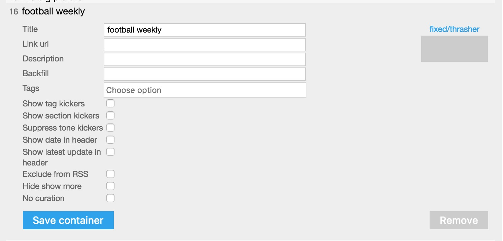
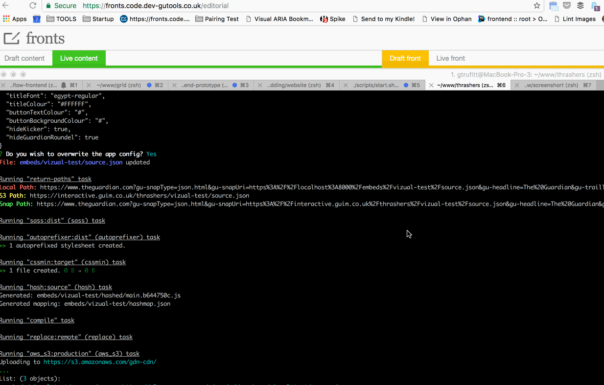
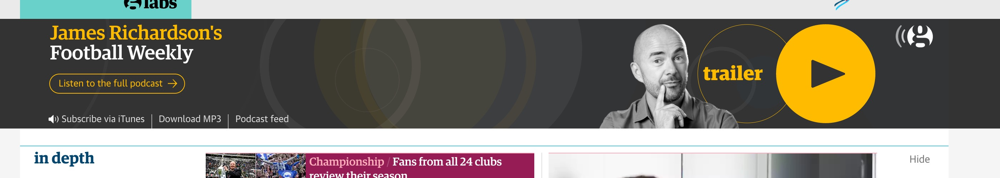

Thrashers
=========

Collection of special Thrasher containers/snaps for the [frontend](https://github.com/guardian/frontend), [ios](https://github.com/guardian/ios-live) and [Android](https://github.com/guardian/android-news-app) projects.


## Installation

You will need

 * [Node.js](http://nodejs.org/)
 * [Homebrew](https://brew.sh/)

Then install the project dependencies with
```
npm install
```

and this script (which may take some time to run depending on how long it takes Homebrew to update)
```
./setup-certs.sh
```

N.b. if Firefox is open when installing the certificates you'll need to restart it

## Usage

### Creating your Thrasher

Get started by creating a new Thrasher with
```
grunt new --folderName=the-name-of-your-embed
```

This will create a folder with the required files at `/embeds/the-name-of-your-embed`. You will be prompted to enter some information about the snap, this is fallback information for while the snap is loading or if it fails. You can always [update](#snapurls) this later.

You are now ready to build your Thrasher using the `style.scss` and `index.html` inside your newly created folder. In order to see your changes though you'll need to compile a `source.json` file and embed the Thrasher on a front.

### Compiling and Deploying

Through the snapURL, the fronts receive a compiled `source.json` file that will include minified versions of your `css` and `html`. There are two ways to compile the JSON, locally and remotely. Both options will watch your folder for changes, compile the relevant file and return snapURLs. The only difference between the two is that one will run a local server and one will upload to S3.

To run locally, use
```
grunt local --folderName=the-name-of-your-embed
```

To run remotely, you'll need to access to Interactives Prod via Janus. With Janus credentials pasted in terminal, run
```
grunt remote --folderName=the-name-of-your-embed
```

To compile and deploy *everything* run the above commands without the `--folderName` option. **WARNING: This should be done with caution, as it might take a while to compile all Thrashers**

### Creating the container

To preview your Thrasher on the site it will need to be added to a front with it's own container. Test on the CODE environment.

The first thing that you'll need to do is create a new container with the name of the thrasher in the Facia Fronts Config tool [Facia fronts config](https://fronts.code.dev-gutools.co.uk/editorial/config).

Make sure to pick `fixed/thrasher` as you'll only need one item. Best practices would be to name it the same as your classes' name space and embed folder. This way anyone can look at the embeds folder and instantly figure out the appropriate name of the container. For example the Thrasher inside `embeds/coal-us` has classes called `.coal-us__*` and requires a container called `coal-us`.

### Getting the snapURL

To embed the Thrasher you'll need to get the snapURL. This is a URL that contains the path to your `source.json` file and fallback information for while the snap is loading or if it fails.

By running either `grunt local --folderName=the-name-of-your-embed` or `grunt remote --folderName=the-name-of-your-embed` commands, the terminal will return both local and remote snapURLs. If you wish to get these URLs without having to watch, compile and deploy, use

```
grunt paths --folderName=the-name-of-your-embed
```

If any of the fallback information has changed since you first ran `grunt new`, you can update those values using

```
grunt update --folderName=the-name-of-your-embed
```

### Embedding the Thrasher

Your thrasher will need to be added to a container on a front of type `fixed/thrasher`.



You can add containers through the [fronts config](https://fronts.code.dev-gutools.co.uk/editorial/config) (you may need to get access from central production).

The appropriate snapURL then needs to be added to your container using the [Facia Fronts Tool](https://fronts.code.dev-gutools.co.uk/editorial).

 You'll need drag it in as an active link onto the clipboard, the result of which then needs to be dragged to the appropriate container. This easiest way is to paste it into the url bar, highlight and drag down into the clipboard:



It should show as `snap json.html`


You can then drag that link into the thrasher container on the front you want the thrasher to appear on.

### Display on Apps

You'll be prompted to provide an app-specific config when running `grunt remote` with the `--folderName=` parameter. If you wish to update the app config without running grunt remote, you can run `grunt appConfig --folderName=<FOLDER>`

If you do not add this specific config, then apps will use the `mainMedia` image from the article, with the card's title.

For example, football weekly, which displays like this on desktop:



will display like this on apps:


### Using HTML, CSS and JavaScript thrashers on iOS and Android fronts

It's important to test on both iOS/Android platforms when using html rather than the fallback image. There's likely to be some browser differences and links may be handled differently.

For advice on how to test/develop for apps please contact the apps team.

## Developing

### Template

When you start a new Thrasher, the file `index.html` contains a suggested baseline for markup structure as well as markup for a button and roundel. A [BEM](https://css-tricks.com/bem-101/) style naming convention is recommended. 

### Buttons

We have a sass mixin to ensure buttons are styled consistenlty. You can see find the mixin here:

`shared/_mixins.scss` 

Use it in your project like this:

```scss
.mythrasher__component-button   {
    @include component-button(#000, #fff, red);
}
```

The colours defined in that example are for (in order) the button background colour, button text colour, button background colour on hover.


### Breakpoints

The way thrashers are injected into the page means you'll be inheriting all of [`frontend's`](http://github.com/guardian/frontend) styles. As a result it's best to stick to the same breakpoints. The templates come, by default, with [`sass-mq`](http://github.com/sass-mq/sass-mq) and a copy of `frontend's` breakpoints. Which should be used like this.

```scss
.coal-us__title {
    font-size: 24px;

    @include mq(tablet) {
        font-size: 32px;
    }
);
```

### Assets

All additional assets should be placed into the `_source` folder. The script will then asset hash them and handle uploading. This, combined with the ability to develop locally and remotely means you'll have to reference the files differently to the way you normally would. If you use `@@assetPath@@` in your `html` or `scss`, the grunt script will replace this part of the path with whatever is appropriate.

```html

```

### Height

Due to the strong use of imagery and other components on the front. For this reason it's best practice to keep the height of a thrasher under `200px` on desktop and `400px` on mobile. These should be taken as max-heights and the smaller the better.

### Animations & transitions

Due to multiple reports of the site crashing on older devices (iPad 2s, older Android smartphones, etc...), it's best to keep animations and transitions to a minimum unless they add a lot of value.

**All animation should be wrapped with a class `flashing-image` so that user's with accessibility issues can remove them. This class will `display: none` the element if the user preference is set.**

### Javascript

Due to the way we inject the thrashers into `frontend` we can't add `<script>` tags in the html. These are stripped out. The work around we've come up with so far, is to have a 1x1px image with an onload event that adds a `<script>` tag.

```html
    
```

Although the same practice applies to javascript as it does for animations and transitions. There has to be a good reason for it to exist and they have to be incredibly light. It's also best not to require heavy libraries like `jQuery` to achieve the same results that could be done with vanilla javascript and/or micro-libraries.
